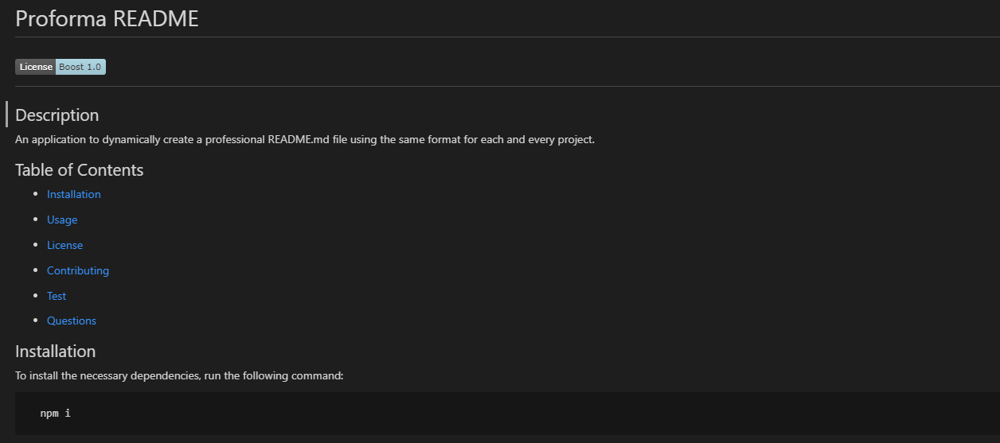

  # c

  # 

  ## Description
  d
  
  ## Table of Contents
  - [Installation](#installation)

  - [Usage](#usage)
  
  - [License](#license)
  
  - [Contributing](#contributing)
  
  - [Test](#tests)
  
  - [Questions](#questions)

  
  ## Installation
  To install the necessary dependencies, run the following command:

      e

  
  ## Usage
    
      e

  ## License
  This project is licensed under Apache 2.0.
  [Click here to view](https://opensource.org/licenses/Apache-2.0)

  ## Contributing
  To contribute, please:

      f

  ## Tests
  To run tests, run the following command:

      npm tests
  
  ## Questions
  If you have any questions about the repo, open an issue or contact me directly at b.  You can find more of my work at (https://github.com/a).
  
  #
  [Click here to see deployed application]()

  #
  Below is a screenshot of the deployed application

   #
  ;
 